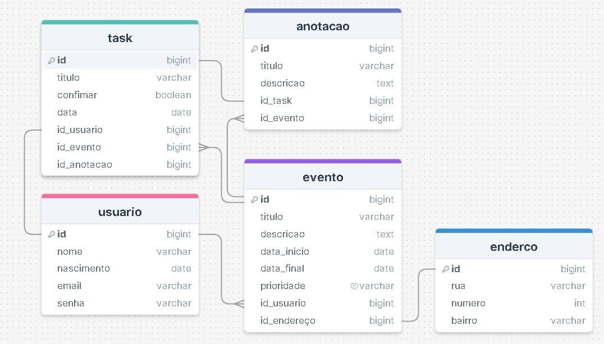
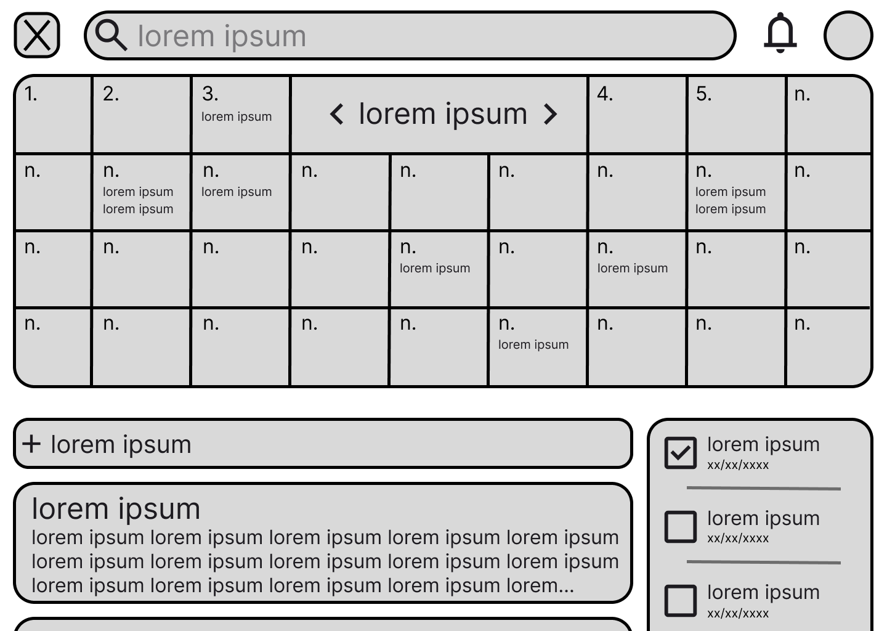
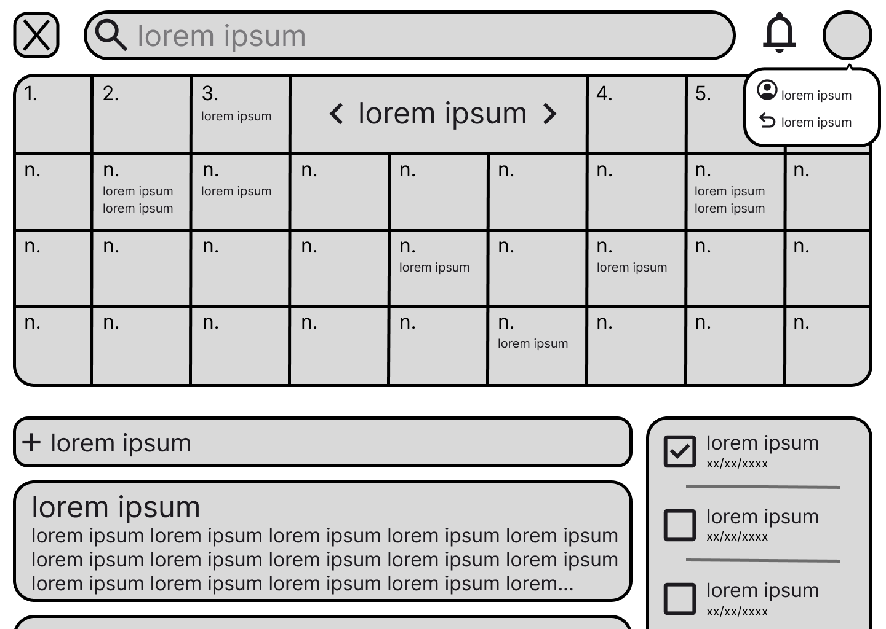
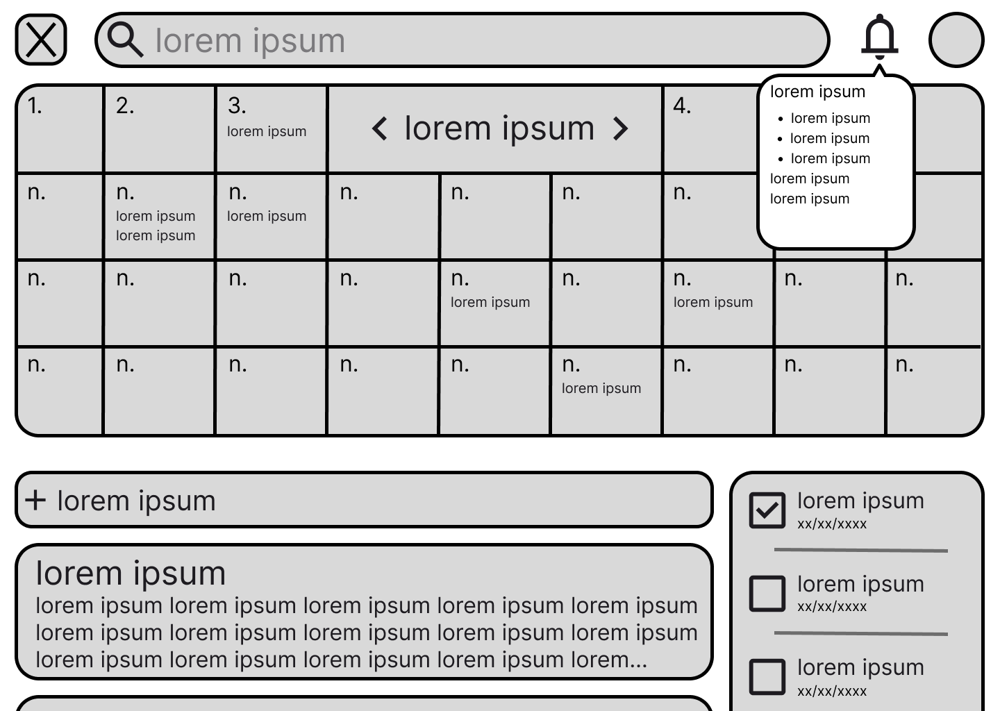
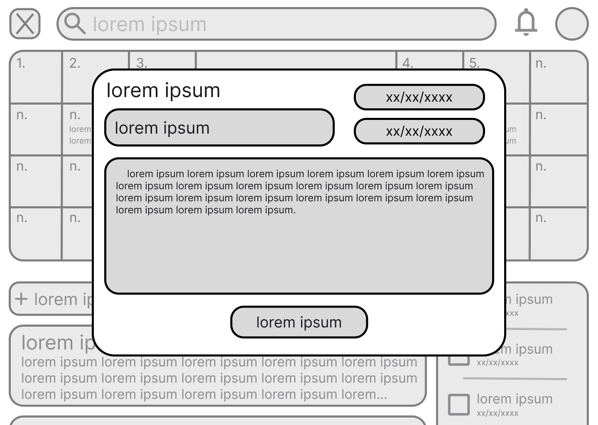
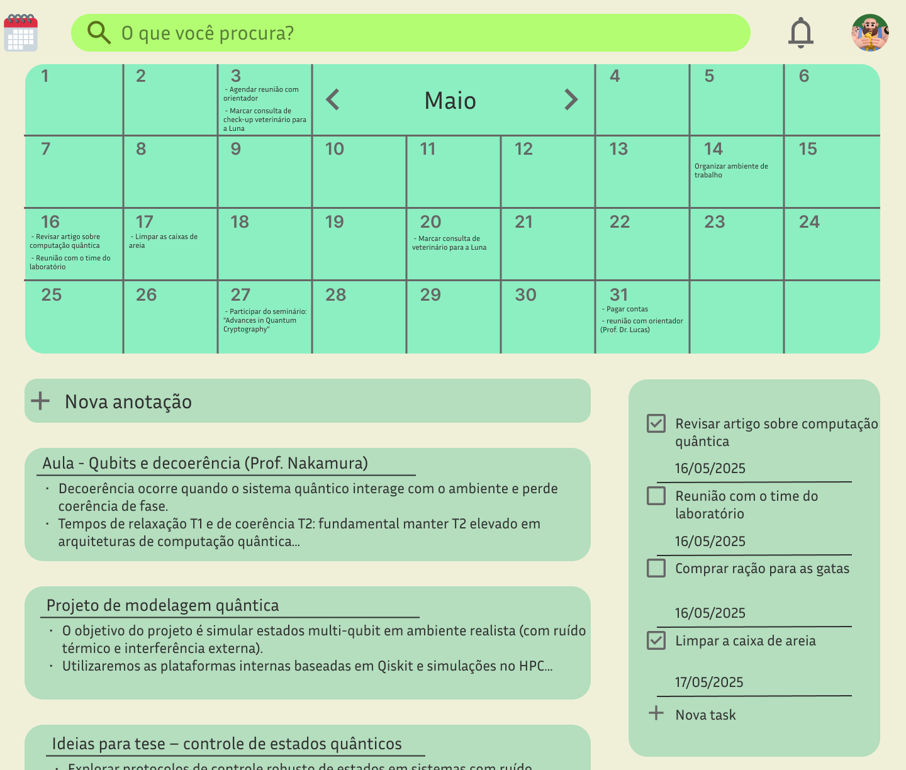
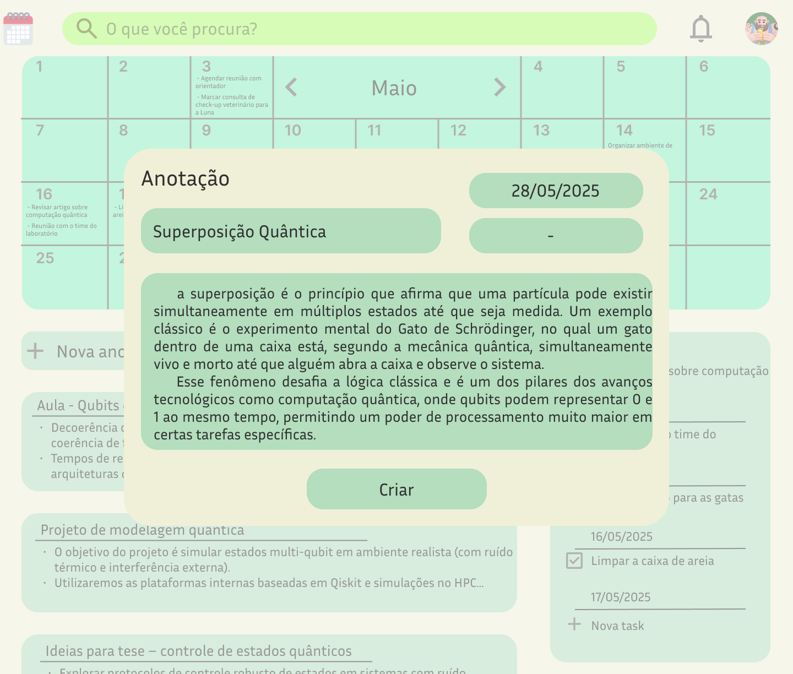
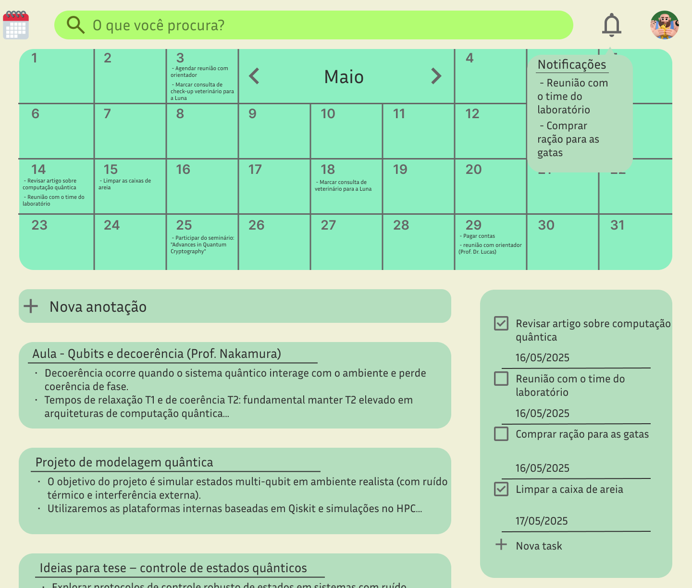
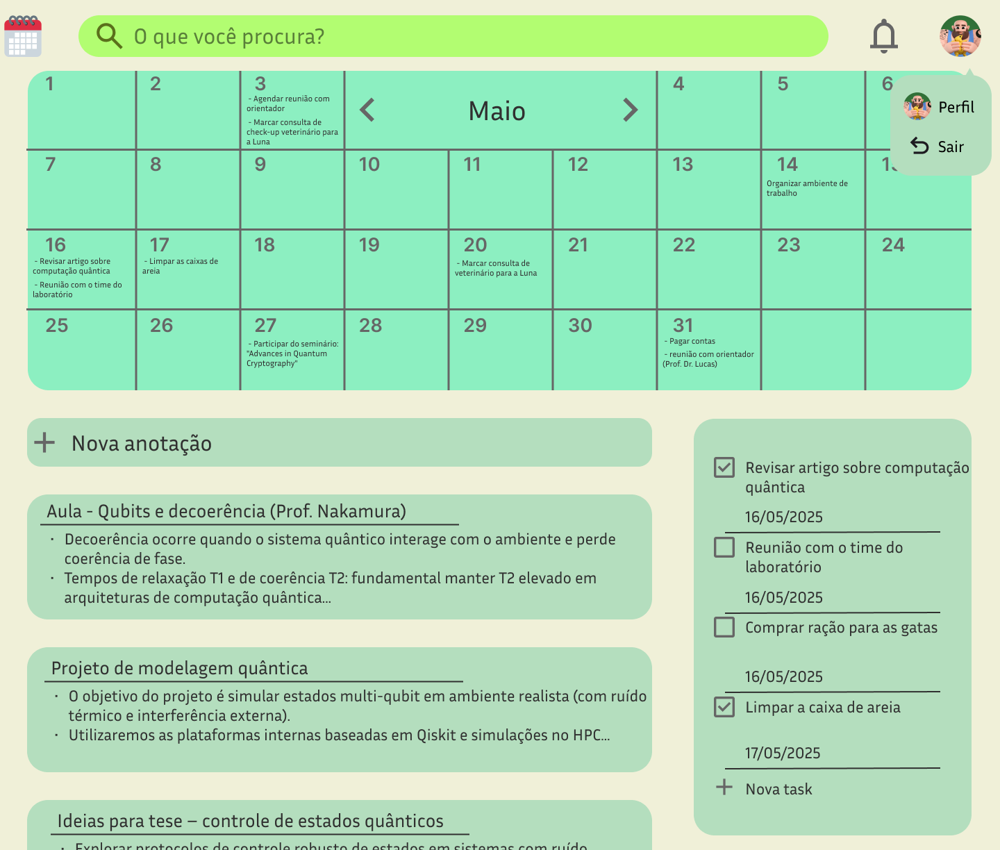

# Web Application Document - Projeto Individual - Módulo 2 - Inteli

**_Os trechos em itálico servem apenas como guia para o preenchimento da seção. Por esse motivo, não devem fazer parte da documentação final._**

## Nome do Projeto

#### Autor do projeto

- <a href="https://www.linkedin.com/in/gabriel-mutter-de-souza-9a0131351">Gabriel Souza</a>

## Sumário

1. [Introdução](#c1)  
2. [Visão Geral da Aplicação Web](#c2)  
3. [Projeto Técnico da Aplicação Web](#c3)  
4. [Desenvolvimento da Aplicação Web](#c4)  
5. [Referências](#c5)  

<br>

## <a name="c1"></a>1. Introdução

O presente documento tem como objetivo descrever o desenvolvimento de um Gerenciador de Tarefas voltado para a organização pessoal e aumento da produtividade. A aplicação web foi projetada para oferecer aos usuários uma maneira prática e eficiente de planejar, monitorar e concluir suas atividades diárias, proporcionando uma experiência intuitiva e funcional.

Em um cenário onde a gestão do tempo e das prioridades é cada vez mais essencial, a proposta deste projeto é criar uma ferramenta que permita o cadastro, categorização, atualização e finalização de tarefas, além de oferecer recursos de organização visual e alertas de prazos.

---

## <a name="c2"></a>2. Visão Geral da Aplicação Web

### 2.1. Personas

A criação de personas é utilizada para representar os usuários-alvo de uma aplicação de forma mais concreta e humanizada. Por meio da construção de personagens fictícios baseados em características reais do público, é possível compreender melhor suas necessidades, comportamentos, dores e objetivos. Essa representação ajuda na desenvolvimento de soluções mais alinhadas às expectativas e demandas dos usuários, garantindo maior usabilidade e eficiência do sistema.

<div align= "center">

</div>

### 2.2. User Stories

As user stories são descrições breves e simples que capturam as necessidades ou desejos dos usuários em relação ao sistema. Elas são formuladas do ponto de vista do próprio usuário e ajudam a guiar o desenvolvimento das funcionalidades de forma focada nas experiências reais. Cada user story geralmente inclui um critério de aceitação, que define as condições que a funcionalidade deve atender para ser considerada concluída. Esse método facilita a comunicação entre as equipes de design, desenvolvimento e stakeholders, promovendo um produto mais centrado no usuário.

Identificação| US01
---|---
Persona|Valkíria Hansen
User Story|"Como engenheira da computação com uma rotina intensa de projetos e reuniões, eu quero adicionar, categorizar e priorizar minhas tarefas em um painel visual para que eu consiga organizar meu dia de forma eficiente e acompanhar meus prazos sem estresse."
Critério de aceite 01|O usuário deve conseguir adicionar uma nova tarefa rapidamente;
Critério de aceite 02|O usuário pode categorizar tarefas (ex.: trabalho, pessoal, estudos);
Critério de aceite 03|O usuário pode definir prioridade (alta, média, baixa);
Critério de aceite 04|As tarefas devem ser exibidas em um painel organizado visualmente.

Identificação| US02
---|---
Persona| Possível usuários da aplicação _web_ em desenvolvimento
User Story|"Como designer freelancer, eu quero receber notificações de prazos de tarefas próximas para garantir que eu entregue meus projetos no prazo e mantenha a confiança dos meus clientes."
Critério de aceite 01|O usuário deve receber notificações antes do vencimento de tarefas;
Critério de aceite 02|O sistema deve permitir configurar com quanto tempo de antecedência avisar (ex.: 1 hora, 1 dia);
Critério de aceite 03|Notificações devem ser claras e exibidas de forma destacada.

Identificação| US03
---|---
Persona| Possível usuários da aplicação _web_ em desenvolvimento
User Story|"Como estudante universitária, eu quero poder dividir grandes projetos em tarefas menores para facilitar o planejamento das entregas acadêmicas e evitar acúmulo de trabalho na última hora."
Critério de aceite 01|O usuário pode criar uma tarefa principal e adicionar subtarefas a ela;
Critério de aceite 02|O sistema deve exibir subtarefas de forma hierárquica ou agrupada;
Critério de aceite 03|Ao concluir todas as subtarefas, a tarefa principal é marcada como concluída automaticamente.

## <a name="c3"></a>3. Projeto da Aplicação Web

### 3.1. Modelagem do banco de dados

Um banco de dados é uma coleção organizada de dados. Seu principal objetivo é armazenar informações de maneira estruturada para facilitar consultas e manipulação por sistemas computacionais. Os bancos de dados são fundamentais em aplicações modernas, permitindo persistência de dados, integridade e escalabilidade.

#### Modelo relacional

O modelo de banco de dados é a forma como os dados são estruturados e organizados dentro do banco. Ele define a lógica de como os dados se relacionam entre si.

O modelo lógico representa a estrutura do banco de dados com foco nas entidades, atributos e nos relacionamentos entre elas. Ele é independente do sistema gerenciador de banco de dados (SGBD) utilizado. No modelo lógico: Entidades viram tabelas, atributos viram colunas e relacionamentos viram chaves estrangeiras ou tabelas intermediárias.

<div align= "center">

</div>

#### Modelo físico

O modelo relacional é a implementação prática do modelo lógico em um SGBD. Nele, todas as entidades e relacionamentos são convertidos em tabelas com tipos de dados específicos, constraints (como PRIMARY KEY, FOREIGN KEY, NOT NULL) e relacionamentos reais.

```sql
    CREATE TABLE IF NOT EXISTS usuario (
    id INT PRIMARY KEY,
    nome VARCHAR(100) NOT NULL,
    nascimento DATE NOT NULL,
    email VARCHAR(100) UNIQUE NOT NULL,
    senha VARCHAR(100) NOT NULL
);

CREATE TABLE IF NOT EXISTS endereco (
    id INT PRIMARY KEY,
    rua VARCHAR(100) NOT NULL,
    numero INT NOT NULL,
    bairro VARCHAR(100)
);

CREATE TABLE IF NOT EXISTS evento (
    id INT PRIMARY KEY,
    titulo VARCHAR(100) NOT NULL,
    descricao TEXT,
    data_inicio DATE NOT NULL,
    data_final DATE NOT NULL,
    prioridade VARCHAR(20),
    id_usuario INT NOT NULL,
    id_endereco INT,
    FOREIGN KEY (id_usuario) REFERENCES usuario(id),
    FOREIGN KEY (id_endereco) REFERENCES endereco(id)
);

CREATE TABLE IF NOT EXISTS task (
    id INT PRIMARY KEY,
    titulo VARCHAR(100) NOT NULL,
    confirmar BOOLEAN DEFAULT 0,
    data DATE NOT NULL,
    id_usuario INT NOT NULL,
    id_evento INT,
    id_anotacao INT,
    FOREIGN KEY (id_usuario) REFERENCES usuario(id),
    FOREIGN KEY (id_evento) REFERENCES evento(id),
    FOREIGN KEY (id_anotacao) REFERENCES anotacao(id)
);

CREATE TABLE IF NOT EXISTS anotacao (
    id INT PRIMARY KEY,
    titulo VARCHAR(100) NOT NULL,
    descricao TEXT,
    id_task INT,
    id_evento INT,
    FOREIGN KEY (id_task) REFERENCES task(id),
    FOREIGN KEY (id_evento) REFERENCES evento(id)
);
```

### 3.1.1 BD e Models

O Model é a camada responsável pela manipulação dos dados em uma aplicação. Ele define a estrutura dos dados, incorpora as regras de negócio, executa operações de acesso ao banco de dados e implementa a lógica de processamento. Essa camada funciona de forma independente da interface do usuário, interagindo com o controlador para receber as requisições, processá-las e retornar os resultados que serão exibidos na visualização. O Model exerce um papel fundamental na separação de responsabilidades, o que contribui para a modularidade e a fácil manutenção do código, além de facilitar a reutilização e a realização de testes automatizados.

#### usuário

- getAll 
- getById 
- create 
- update 
- delete 

#### Endereço

- getAll 
- getById 
- create 
- update 
- delete 

#### Evento

- getAll 
- getById 
- create 
- update 
- delete 

#### Task

- getAll 
- getById 
- create 
- update 
- delete 

#### Anotação

- getAll 
- getById 
- create 
- update
- delete 

### 3.2. Arquitetura

Um diagrama de arquitetura é uma representação visual que mostra como os principais componentes de um sistema estão organizados e como eles se relacionam entre si.

<div align= "center">

</div>

### 3.3. Wireframes

#### wireframe da tela inicial

A imagem abaixo é o wireframe da tela inicial. Após fazer login, esta será a primeira tela exibida. Nela, é possível visualizar um grande calendário, onde o usuário poderá anotar os eventos que terá ao longo do mês. Logo abaixo, há alguns retângulos com textos, que servem para o usuário fazer anotações relacionadas aos eventos que irá ou está participando. À direita, é possível observar uma seção destinada às tarefas (tasks), onde serão exibidas as atividades que o usuário precisa realizar naquele dia, de acordo com o calendário ou com alguma tarefa previamente criada. Esse quadro de tarefas está alinhado com a necessidade descrita na user story 3.

<div align= "center">

</div>

#### wireframe da tela inicial com o menu da conta aberto

Nesta tela, o menu da conta está aberto, exibindo apenas dois botões: um para efetuar o logout e outro para visualizar os detalhes da conta.

<div align= "center">

</div>

#### wireframe da tela inicial com o menu de notificações aberto

Aqui, o menu de notificações está aberto. Nele, será possível visualizar as tarefas que estão atrasadas ou próximas do prazo final. Isso está alinhado com a User Story 2, que solicita uma barra de notificações para que o usuário não perca os prazos.

<div align= "center">

</div>

#### wireframe da tela de criar anotação 

Esta tela aparece quando o usuário cria uma nova anotação, permitindo que ele insira as informações que considerar necessárias.

<div align= "center">

</div>

### 3.4. Guia de estilos

Este guia de estilos tem como objetivo padronizar o desenvolvimento visual e técnico do sistema, garantindo uma aparência consistente, uma melhor organização do código e uma experiência de usuário unificada em todas as partes do projeto.

<a href = "https://www.figma.com/design/UuUwHlxcbYgIYmgJYQ21EX/Untitled?node-id=0-1&t=C88TsD9gcdeJ5TB2-1"> Clique aqui para ver o guia de estilo. </a>

### 3.5. Protótipo de alta fidelidade

#### protótipo da tela inicial

<div align= "center">

</div>

#### protótipo da tela de criar anotação

<div align= "center">

</div>

#### protótipo da tela inicial com o menu de notificações aberto

<div align= "center">

</div>

#### protótipo da tela inicial com o menu da conta aberto

<div align= "center">

</div>

### 3.6. WebAPI e endpoints 

Esta seção descreve a Web API desenvolvida para a aplicação, detalhando os endpoints disponíveis, seus respectivos métodos HTTP e os formatos esperados de requisição e resposta.

A Web API serve como a camada de comunicação entre o frontend e o backend, permitindo que as funcionalidades do sistema sejam acessadas por meio de requisições HTTP. Com isso, é possível realizar operações como criação, consulta, atualização e exclusão de dados de forma estruturada, segura e padronizada.

Cada endpoint representa uma rota da aplicação responsável por executar uma ação específica, como cadastrar usuários, listar tarefas, ou atualizar eventos. Esta documentação tem como objetivo fornecer uma visão clara de como interagir com a API, facilitando a integração e o desenvolvimento contínuo do sistema.

Rota |  Método  |  Header  |  Body  | Formatos de response 
:---:|:---:|:---:|:---:|:-------:
/users | GET | application.json | nome, nascimento, email, senha | JSON |
/tasks | POST | application.json | titulo, data, id_usuario, id_anotacao | JSON |
/anotacaos | POST | application.json | titulo, descricao | JSON |
/eventos | GET | application.json | titulo, descricao, data_inicio, data_final, prioridade, id_usuario, id_endereco | JSON |
/enderecos | GET | application.json | rua, numero, bairro | JSON |

### 3.7 Interface e Navegação 

NNesta seção é apresentado o desenvolvimento da interface gráfica do sistema web SchaduleUP, detalhando as telas principais implementadas: Login, Cadastro de Usuário e Tela Principal. O frontend foi desenvolvido com HTML, CSS tradicional e JavaScript puro, focando em um layout limpo, moderno e funcional. A aplicação segue uma estrutura responsiva e utiliza fontes elegantes como Inter e Segoe UI, além de cores suaves para proporcionar uma boa experiência de uso.

#### tela de login:

A primeira interface desenvolvida foi a tela de login, responsável por autenticar o usuário no sistema. Ela apresenta um formulário simples com campos de email e senha, e utiliza JavaScript para realizar o envio dos dados por meio de requisições fetch para a rota /usuarios/login.

A interface foi construída de forma responsiva, com uma caixa centralizada, bordas arredondadas, tipografia clara e mensagens de erro exibidas dinamicamente, proporcionando feedback imediato ao usuário em caso de falha na autenticação.

Características implementadas:

- Formulário com validação obrigatória (required);

- Exibição de mensagens de erro personalizadas;

- Integração com backend para autenticação;

- Redirecionamento em caso de sucesso.

``` javascript

<!DOCTYPE html>
<html lang="pt-BR">

<head>
    <meta charset="UTF-8">
    <meta name="viewport" content="width=device-width, initial-scale=1.0">
    <link rel="stylesheet" href="/css/style.css">
    <title>SchaduleUP - Login</title>
</head>

<body>
    <div class="background">
        <div class="login-box">
            <div class="logo-title">
                
                <h1 class="titulo">SchaduleUP</h1>
            </div>

            <h3 class="subtitulo">Login</h3>

            <form id="loginForm">
                <input type="email" id="email" name="email" placeholder="Email" required>
                <input type="password" id="senha" name="senha" placeholder="Senha" required>
                <button type="submit">Entrar</button>
            </form>
            <p id="errorMessage" style="color: red; margin-top: 10px;"></p>

            <p class="signup-link">Não tem login ainda? <a href="/cadastro">cadastre-se</a></p>
        </div>
    </div>
</body>

<script>
    document.getElementById('loginForm').addEventListener('submit', async function (e) {
        e.preventDefault();
        const email = document.getElementById('email').value;
        const senha = document.getElementById('senha').value;
        const errorMessageElement = document.getElementById('errorMessage');
        errorMessageElement.textContent = '';

        try {
            const response = await fetch('/usuarios/login', {
                method: 'POST',
                headers: {
                    'Content-Type': 'application/json'
                },
                body: JSON.stringify({ email, senha })
            });

            const data = await response.json();

            // Debug: mostrar resposta do servidor
            console.log('Status:', response.status, 'Data:', data);            if (response.ok && data.success) {
                if (data.redirect) {
                    window.location.href = data.redirect;
                }
            } else {
                errorMessageElement.textContent = data.message || 'Email ou senha inválidos.';
            }
        } catch (error) {
            errorMessageElement.textContent = 'Ocorreu um erro ao tentar fazer login.';
            console.error(error);
        }
    });
</script>

</html>

```

#### Tela de cdastro:

A tela de cadastro de novo usuário permite que pessoas ainda não registradas preencham seus dados (nome, data de nascimento, email e senha) para criarem uma conta no sistema.

O layout segue o mesmo padrão visual da tela de login, reforçando a identidade visual do sistema. Todos os campos são obrigatórios e o envio é feito via método POST para a rota /users.

Características implementadas:

- Layout padronizado e moderno;

- Inputs com design amigável e acessível;

- Validação básica no lado do cliente;

- Integração com backend para registro de usuários.

``` javascript

<!DOCTYPE html>
<html lang="pt-BR">

<head>
  <meta charset="UTF-8" />
  <meta name="viewport" content="width=device-width, initial-scale=1.0" />
  <link rel="stylesheet" href="/CSS/style.css" />
  <title>SchaduleUP - Cadastro</title>
</head>

<style>
  * {
    margin: 0;
    padding: 0;
    box-sizing: border-box;
    font-family: 'Segoe UI', Tahoma, Geneva, Verdana, sans-serif;
  }

  body,
  html {
    height: 100%;
  }

  .background {
    background-color: #f7f6df;
    height: 100vh;
    display: flex;
    justify-content: center;
    align-items: center;
  }

  .login-box {
    background-color: #75cba2;
    padding: 40px 30px;
    border-radius: 20px;
    width: 300px;
    text-align: center;
    box-shadow: 0 4px 10px rgba(0, 0, 0, 0.1);
  }

  .logo-title {
    display: flex;
    align-items: center;
    justify-content: center;
    gap: 10px;
    margin-bottom: 10px;
  }

  .logo-title img {
    width: 40px;
    height: 40px;
  }

  .logo-title h1 {
    font-size: 22px;
  }

  .login-box h2 {
    font-size: 18px;
    margin-bottom: 20px;
  }

  .login-box input {
    width: 100%;
    padding: 10px;
    border-radius: 25px;
    border: none;
    margin: 10px 0;
    background-color: #c0e1c5;
    font-size: 14px;
  }

  .login-box button {
    background-color: #c3e521;
    color: black;
    font-weight: bold;
    border: none;
    border-radius: 15px;
    padding: 10px 20px;
    margin-top: 10px;
    cursor: pointer;
    transition: background 0.3s ease;
  }

  .login-box button:hover {
    background-color: #afcf1e;
  }

  .signup-link a {
    text-decoration: none;
    color: black;
    font-weight: bold;
    font-size: 11px;
  }

  .signup-link {
    margin-top: 15px;
    font-size: 12px;
  }

  .signup-link a:hover {
    text-decoration: underline;
  }
</style>

<body>
  <div class="background">
    <div class="login-box">
      <div class="logo-title">
        
        <h1>SchaduleUP</h1>
      </div>

      <h2>Cadastrar</h2>

      <form action="/users" method="POST">
        <input type="text" id="nome" name="nome" placeholder="Nome" required />
        <p>data de nascimento</p>
        <input type="date" id="nascimento" name="nascimento" placeholder="Nascimento" required />
        <input type="email" id="email" name="email" placeholder="Email" required />
        <input type="password" id="senha" name="senha" placeholder="Senha" required />
        <button type="submit">Cadastrar</button>
      </form>
      <p class="signup-link"><a href="/login">Já tenho cadastro</a></p>
    </div>
  </div>
</body>

</html>

```

#### pagina principal:

Após o login, o usuário é redirecionado para a página principal, onde é possível interagir com o calendário e visualizar/adicionar tarefas e anotações.

A tela principal é composta por:

- Cabeçalho com barra de pesquisa, ícone de perfil e notificações;

- Calendário dinâmico, que exibe os dias do mês atual e permite a navegação entre meses;

- Botões interativos para adicionar anotações e tarefas;

- Modais (popups) para criação de conteúdo;

- Renderização dinâmica de tarefas e anotações com fetch e DOM manipulation.

Essa interface é responsável por centralizar as funcionalidades do sistema, sendo o ponto focal da produtividade do usuário. O calendário foi implementado manualmente com JavaScript puro, incluindo lógica para atualização dos meses e exibição correta dos dias.

Funcionalidades desenvolvidas:

- Exibição do mês atual e navegação entre meses;

- Criação de tarefas com título e data;

- Criação de anotações com título e descrição;

- Exibição dinâmica das tarefas e anotações armazenadas no banco;

- Feedback visual imediato ao criar novos conteúdos.

``` javascript

<!DOCTYPE html>
<html lang="en">

<head>
  <meta charset="UTF-8">
  <meta name="viewport" content="width=device-width, initial-scale=1.0">
  <title>SchaduleUP - home</title>
</head>

<style>
  * {
    margin: 0;
    padding: 0;
    box-sizing: border-box;
  }

  body {
    font-family: 'Inter', sans-serif;
    background-color: #f3f0d7;
    padding: 20px;
    color: #333;
  }

  /* Header */
  header {
    display: flex;
    align-items: center;
    gap: 20px;
    padding: 10px 20px;
    background-color: transparent;
  }

  header img {
    height: 40px;
  }

  header input[type="text"] {
    flex: 1;
    padding: 10px 15px;
    border-radius: 20px;
    border: none;
    background-color: #c1ff88;
    font-size: 16px;
  }

  header button {
    background: none;
    border: none;
    cursor: pointer;
  }

  header button img {
    width: 25px;
    height: 25px;
  }

  main h1 {
    margin-top: 20px;
    font-size: 24px;
  }

  main h2 {
    margin-top: 30px;
    font-size: 20px;
  }

  #mes-atual {
    font-weight: bold;
    font-size: 18px;
  }

  /* Tabela do calendário */
  #calendario {
    width: 100%;
    max-width: 800px;
    margin-top: 10px;
    border-collapse: collapse;
    background-color: #86f4b8;
    border-radius: 20px;
    overflow: hidden;
    box-shadow: 0 4px 8px rgba(0, 0, 0, 0.1);
  }

  #calendario th {
    background-color: #6fe2a2;
    padding: 15px;
    font-weight: 600;
    font-size: 16px;
  }

  #calendario td {
    text-align: center;
    padding: 20px;
    height: 80px;
    font-size: 16px;
    border: 1px solid #e1f8ea;
    background-color: #a5f7c9;
  }

  #calendario td:hover {
    background-color: #78ecad;
    cursor: pointer;
  }

  #calendario td.empty {
    background-color: #d8fce9;
  }

  /* Navegação do mês */
  #mes-anterior,
  #mes-proximo {
    font-size: 20px;
    padding: 8px 12px;
    border: none;
    border-radius: 8px;
    background-color: #b2dfbf;
    cursor: pointer;
    transition: background 0.3s;
  }

  #mes-anterior:hover,
  #mes-proximo:hover {
    background-color: #99d8b0;
  }

  .actions {
    display: flex;
    justify-content: center;
    gap: 20px;
    margin-top: 20px;
  }

  .add-note,
  .add-task {
    display: flex;
    align-items: center;
    gap: 10px;
    padding: 10px 20px;
    background-color: #a5f7c9;
    border-radius: 10px;
    border-color: #a5f7c9;
  }

  .add-note:hover,
  .add-task:hover {
    background-color: #78ecad;
  }

  .actions {
    display: flex;
    gap: 30px;
    margin-top: 40px;
    padding-left: 10px;
  }

  .add-note,
  .add-task {
    background-color: #b2dfbf;
    border: none;
    border-radius: 15px;
    padding: 20px 25px;
    font-size: 18px;
    display: flex;
    align-items: center;
    gap: 10px;
    cursor: pointer;
    width: 320px;
    height: 70px;
    box-shadow: 0 2px 5px rgba(0, 0, 0, 0.1);
    font-family: 'Inter', sans-serif;
  }

  .add-note .plus,
  .add-task .plus {
    font-size: 26px;
    font-weight: bold;
    color: #333;
  }

  .add-task {
    flex-direction: column;
    align-items: flex-start;
    justify-content: center;
    position: relative;
  }

  .add-task span {
    font-size: 18px;
  }

  .add-task .line {
    width: 100%;
    height: 2px;
    background-color: #333;
    margin-top: 8px;
  }

  /* Overlay de fundo */
  .popup-overlay {
    position: fixed;
    top: 0;
    left: 0;
    width: 100%;
    height: 100%;
    background-color: rgba(50, 50, 50, 0.4);
    display: none;
    /* começa escondido */
    justify-content: center;
    align-items: center;
    z-index: 1000;
  }

  /* Caixa do popup */
  .popup {
    background-color: #f3f0d7;
    padding: 30px;
    border-radius: 25px;
    width: 600px;
    max-width: 90%;
    box-shadow: 0 4px 15px rgba(0, 0, 0, 0.2);
    display: flex;
    flex-direction: column;
    gap: 15px;
    font-family: 'Inter', sans-serif;
  }

  .popup h2 {
    font-size: 22px;
    font-weight: bold;
  }

  /* Inputs */
  .popup input[type="text"],
  .popup input[type="date"] {
    padding: 12px 15px;
    font-size: 16px;
    border: none;
    border-radius: 15px;
    background-color: #b2dfbf;
    width: 100%;
  }

  .popup textarea {
    resize: vertical;
    min-height: 100px;
    padding: 15px;
    font-size: 15px;
    border: none;
    border-radius: 15px;
    background-color: #fff;
    line-height: 1.6;
    font-family: 'Inter', sans-serif;
  }

  /* Botão Criar */
  .popup-criar {
    background-color: #b2dfbf;
    border: none;
    border-radius: 15px;
    padding: 12px 20px;
    font-size: 18px;
    cursor: pointer;
    align-self: center;
    margin-top: 10px;
    transition: background-color 0.3s;
  }

  .popup-criar:hover {
    background-color: #9dd8ae;
  }

  .popup-observacao {
    padding: 12px 15px;
    font-size: 16px;
    border: none;
    border-radius: 15px;
    background-color: #b2dfbf;
    width: 100%;
  }

  .conteudo-criado {
    display: flex;
    flex-direction: row;
    justify-content: center;
    align-items: flex-start;
    gap: 30px;
    margin-top: 20px;
    width: 100%;
    max-width: 800px;
  }

  #anotacoes,
  #tasks {
    display: flex;
    flex-direction: column;
    gap: 20px;
    flex: 1;
    align-items: center;
    width: 100%;
  }

  /* Estilo das anotações */
  .anotacao-box {
    background-color: #b2dfbf;
    border-radius: 20px;
    padding: 20px;
    width: 100%;
    max-width: 350px;
    box-sizing: border-box;
    margin: 0 auto;
  }

  .anotacao-box h3 {
    font-size: 18px;
    margin-bottom: 10px;
  }

  .anotacao-box p {
    font-size: 14px;
    line-height: 1.5;
    margin-top: 10px;
  }

  /* Estilo das tasks */
  .task-box {
    background-color: #b2dfbf;
    border-radius: 20px;
    padding: 20px;
    width: 100%;
    max-width: 350px;
    box-sizing: border-box;
    margin: 0 auto;
    position: relative;
  }

  .task-box span {
    font-size: 14px;
    display: block;
  }

  .task-box .task-title {
    font-weight: bold;
    font-size: 16px;
    margin-bottom: 8px;
  }

  .task-box .task-date {
    font-size: 13px;
    margin-bottom: 8px;
  }

  .task-box .task-notes {
    font-size: 14px;
    color: #444;
  }
</style>

<body>
  <header>
    
    <input type="text" placeholder="O que você procura?">
    <button></button>
    <button></button>
  </header>

  <main style="display: flex; flex-direction: column; align-items: center; justify-content: center;">
    <h1>Bem-vindo ao SchaduleUP!</h1>
    <div style="display: flex; align-items: center; gap: 10px; margin: 10px;">
      <button id="mes-anterior">&#8592;</button>
      <span id="mes-atual"></span>
      <button id="mes-proximo">&#8594;</button>
    </div>
    <table id="calendario" border="1">

      <thead>
        <tr>
          <th>Dom</th>
          <th>Seg</th>
          <th>Ter</th>
          <th>Qua</th>
          <th>Qui</th>
          <th>Sex</th>
          <th>Sáb</th>
        </tr>
      </thead>
      <tbody>
      </tbody>
    </table>
    <div class="actions">
      <button class="add-note">
        <span class="plus">+</span>
        <span>Nova anotação</span>
      </button>

      <div class="add-task">
        <span>Nova task</span>
        <div class="line"></div>
      </div>
    </div>

    <form action="/anotacaos" method="post">
      <div class="popup-overlay" id="popup-anotacao">
        <div class="popup">
          <h2>Anotação</h2>
          <input type="text" name="titulo" placeholder="Título da anotação" class="popup-titulo" required>

          <textarea name="descricao" placeholder="Digite sua anotação aqui..." required></textarea>

          <input type="hidden" name="id_usuario" value="1">

          <button type="submit" class="popup-criar">Criar</button>
        </div>
      </div>
    </form>
    <form action="/tasks" method="post">
      <div class="popup-overlay" id="popup-task">
        <div class="popup">
          <h2>Task</h2>

          <input type="text" name="titulo" placeholder="Título da task" class="popup-titulo" required>

          <h5>Data final</h5>
          <input type="date" name="data" class="popup-data" required>

          <input type="hidden" name="id_usuario" value="1">

          <button type="submit" class="popup-criar">Criar</button>

        </div>
      </div>
    </form>
    <div class="conteudo-criado">
      <div id="anotacoes"></div>
      <div id="tasks"></div>
    </div>
  </main>
  <script>
    const nomesMeses = [
      "Janeiro", "Fevereiro", "Março", "Abril", "Maio", "Junho",
      "Julho", "Agosto", "Setembro", "Outubro", "Novembro", "Dezembro"
    ];
    let hoje = new Date();
    let mesAtual = hoje.getMonth();
    let anoAtual = hoje.getFullYear();

    function criarCalendario(mes, ano) {
      document.getElementById('mes-atual').textContent = `${nomesMeses[mes]} ${ano}`;
      const tbody = document.querySelector('#calendario tbody');
      tbody.innerHTML = '';
      const primeiroDia = new Date(ano, mes, 1).getDay();
      const diasNoMes = new Date(ano, mes + 1, 0).getDate();
      let linha = document.createElement('tr');
      for (let i = 0; i < primeiroDia; i++) {
        linha.appendChild(document.createElement('td'));
      }
      for (let dia = 1; dia <= diasNoMes; dia++) {
        if ((primeiroDia + dia - 1) % 7 === 0 && dia !== 1) {
          tbody.appendChild(linha);
          linha = document.createElement('tr');
        }
        const td = document.createElement('td');
        td.textContent = dia;
        linha.appendChild(td);
      }
      tbody.appendChild(linha);
    }

    document.getElementById('mes-anterior').addEventListener('click', function () {
      mesAtual--;
      if (mesAtual < 0) {
        mesAtual = 11;
        anoAtual--;
      }
      criarCalendario(mesAtual, anoAtual);
    });

    document.getElementById('mes-proximo').addEventListener('click', function () {
      mesAtual++;
      if (mesAtual > 11) {
        mesAtual = 0;
        anoAtual++;
      }
      criarCalendario(mesAtual, anoAtual);
    });

    criarCalendario(mesAtual, anoAtual);

    document.querySelector('.add-note').addEventListener('click', () => {
      document.getElementById('popup-anotacao').style.display = 'flex';
    });

    document.getElementById('popup-anotacao').addEventListener('click', (e) => {
      if (e.target.id === 'popup-anotacao') {
        e.currentTarget.style.display = 'none';
      }
    });

    // Função para carregar anotações
    function carregarAnotacoes() {
      fetch('/anotacaos')
        .then(response => response.json())
        .then(anotacoes => {
          const container = document.getElementById('anotacoes');
          container.innerHTML = ''; // Limpa o container
          anotacoes.forEach(anotacao => {
            const box = document.createElement('div');
            box.classList.add('anotacao-box');
            box.innerHTML = `
              <h3>${anotacao.titulo}</h3>
              <p>${anotacao.descricao}</p>
            `;
            container.appendChild(box);
          });
        })
        .catch(error => console.error('Erro ao carregar anotações:', error));
    }

    // Carregar anotações ao iniciar
    carregarAnotacoes();

    // Lidar com o envio do formulário de anotação
    document.querySelector('form[action="/anotacaos"]').addEventListener('submit', function(e) {
      e.preventDefault();
      
      const titulo = this.querySelector('[name="titulo"]').value;
      const descricao = this.querySelector('[name="descricao"]').value;
      
      fetch('/anotacaos', {
        method: 'POST',
        headers: {
          'Content-Type': 'application/json'
        },
        body: JSON.stringify({
          titulo: titulo,
          descricao: descricao
        })
      })
      .then(response => {
        if (!response.ok) {
          throw new Error('Erro ao criar anotação');
        }
        return response.json();
      })
      .then(novaAnotacao => {
        carregarAnotacoes(); // Recarrega todas as anotações
        this.reset(); // Limpa o formulário
        document.getElementById('popup-anotacao').style.display = 'none'; // Fecha o popup
      })
      .catch(error => {
        console.error('Erro:', error);
        alert('Erro ao criar anotação. Por favor, tente novamente.');
      });
    });

    document.querySelector('.add-task').addEventListener('click', () => {
      document.getElementById('popup-task').style.display = 'flex';
    });

    document.getElementById('popup-task').addEventListener('click', (e) => {
      if (e.target.id === 'popup-task') {
        e.currentTarget.style.display = 'none';
      }
    });

    // Carregar tasks existentes quando a página carregar
    window.addEventListener('DOMContentLoaded', () => {
      fetch('/tasks')
        .then(response => response.json())
        .then(tasks => {
          const container = document.getElementById('tasks');
          tasks.forEach(task => {
            const box = createTaskBox(task);
            container.appendChild(box);
          });
        })
        .catch(error => console.error('Erro ao carregar tasks:', error));
    });

    // Função para criar o elemento visual da task
    function createTaskBox(task) {
      const box = document.createElement('div');
      box.classList.add('task-box');
      box.innerHTML = `
        <div class="task-title">${task.titulo}</div>
        <div class="task-date">${new Date(task.data).toLocaleDateString('pt-BR')}</div>
      `;
      return box;
    }

    // Modificar o comportamento do formulário para usar AJAX
    document.querySelector('form[action="/tasks"]').addEventListener('submit', function(e) {
      e.preventDefault();
      
      const formData = new FormData(this);
      const data = {
        titulo: formData.get('titulo'),
        data: formData.get('data'),
        id_usuario: formData.get('id_usuario')
      };

      fetch('/tasks', {
        method: 'POST',
        headers: {
          'Content-Type': 'application/json'
        },
        body: JSON.stringify(data)
      })
      .then(response => response.json())
      .then(task => {
        const container = document.getElementById('tasks');
        const box = createTaskBox(task);
        container.appendChild(box);
        
        // Limpar e fechar o formulário
        this.reset();
        document.getElementById('popup-task').style.display = 'none';
      })
      .catch(error => console.error('Erro ao criar task:', error));
    });

    // Criação de Anotação
    document.querySelector('#popup-anotacao .popup-criar').addEventListener('click', () => {
      const titulo = document.querySelector('#popup-anotacao .popup-titulo').value.trim();
      const texto = document.querySelector('#popup-anotacao textarea').value.trim();

      if (titulo && texto) {
        const container = document.getElementById('anotacoes');

        const box = document.createElement('div');
        box.classList.add('anotacao-box');

        box.innerHTML = `
        <h3>${titulo}</h3>
        <p>${texto}</p>
      `;

        container.appendChild(box);
        document.getElementById('popup-anotacao').style.display = 'none';
      }
    });

    // Código específico para anotações
    function carregarAnotacoes() {
      fetch('/anotacaos')
        .then(response => response.json())
        .then(anotacoes => {
          const container = document.getElementById('anotacoes');
          container.innerHTML = ''; // Limpa o container antes de adicionar
          anotacoes.forEach(anotacao => {
            const box = document.createElement('div');
            box.classList.add('anotacao-box');
            box.innerHTML = `
              <h3>${anotacao.titulo}</h3>
              <p>${anotacao.descricao}</p>
            `;
            container.appendChild(box);
          });
        })
        .catch(error => console.error('Erro ao carregar anotações:', error));
    }

    // Carregar anotações quando a página iniciar
    document.addEventListener('DOMContentLoaded', function() {
      carregarAnotacoes();
    });

    // Manipular o formulário de anotações
    const formAnotacao = document.querySelector('form[action="/anotacaos"]');
    if (formAnotacao) {
      formAnotacao.addEventListener('submit', function(e) {
        e.preventDefault();
        
        const formData = new FormData(this);
        const data = {
          titulo: formData.get('titulo'),
          descricao: formData.get('descricao'),
          id_usuario: formData.get('id_usuario')
        };

        fetch('/anotacaos', {
          method: 'POST',
          headers: {
            'Content-Type': 'application/json'
          },
          body: JSON.stringify(data)
        })
        .then(response => response.json())
        .then(novaAnotacao => {
          // Recarregar todas as anotações
          carregarAnotacoes();
          
          // Limpar e fechar o formulário
          this.reset();
          document.getElementById('popup-anotacao').style.display = 'none';
        })
        .catch(error => console.error('Erro ao criar anotação:', error));
      });
    }

  </script>
</body>

</html>

``` 

## <a name="c4"></a>4. Desenvolvimento da Aplicação Web 

### 4.1 Demonstração do Sistema Web 

Link para o vídeo de demonstração: https://drive.google.com/file/d/1cck1cHDl54ofeWapjb7c3CKUivhQi0VJ/view?usp=sharing

### 4.2 Conclusões e Trabalhos Futuros

O desenvolvimento do sistema SchaduleUP proporcionou uma experiência rica tanto do ponto de vista técnico quanto do aprendizado prático. Ao longo do projeto, foram implementadas funcionalidades essenciais para um sistema de organização pessoal, como cadastro e login de usuários, integração com banco de dados, criação de tarefas e anotações, e exibição dessas informações em um calendário dinâmico.

Pontos Fortes
- Interface intuitiva e agradável: O frontend foi desenvolvido com foco na experiência do usuário, utilizando cores suaves, elementos responsivos e tipografia clara.

- Funcionalidade de calendário dinâmica: O calendário interativo, implementado com JavaScript puro, se mostrou eficiente para navegação entre meses e organização visual de tarefas.

- Integração entre frontend e backend: As requisições fetch e a troca de dados via JSON entre cliente e servidor funcionam de forma fluida, permitindo uma experiência quase em tempo real.

- Organização modular do código: A divisão por arquivos HTML, CSS e JS, além da arquitetura em camadas (rotas, controllers, models), facilita a manutenção e expansão do sistema.

Pontos a Melhorar
- Validações mais robustas: Apesar das validações básicas no frontend, o sistema ainda pode se beneficiar de validações mais completas tanto no frontend quanto no backend, como verificação de senha segura e confirmação de email.

- Design responsivo para dispositivos móveis: Algumas partes do layout, embora funcionais em telas maiores, podem ser aprimoradas para garantir melhor usabilidade em smartphones.

- Gerenciamento de sessão e autenticação avançada: Atualmente, a lógica de login é funcional, mas pode ser melhorada com autenticação por tokens (JWT), controle de sessão e segurança contra ataques como CSRF.

Trabalhos Futuros e Melhorias Possíveis
Com o sistema funcional em seu núcleo, há diversas possibilidades de evolução, como:

- Adição de categorias e filtros para tarefas e anotações, permitindo uma melhor organização por tipo, prioridade ou status.

- Notificações automatizadas por e-mail ou push, lembrando o usuário de tarefas próximas ao vencimento.

- Modo escuro e personalização de temas, para atender diferentes preferências visuais.

- Funcionalidade de compartilhamento, onde tarefas ou eventos poderiam ser atribuídos a mais de um usuário.

- Dashboard com estatísticas de produtividade, exibindo, por exemplo, número de tarefas concluídas por semana ou tempo médio para finalização.

- Integração com serviços externos, como Google Calendar ou Trello, ampliando a utilidade do sistema.


## <a name="c5"></a>5. Referências
